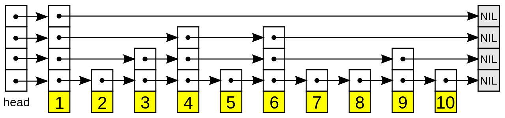

# Monotonic Stack
A Monotonic stack is a stack that has all of its elements
arranged according to some type of rule.

All elements must be in decreasing order.
All element must be in increasing order.

If an element comes a long that does not fit into 
that rule then elements need to be popped off of
the stack until the rule holds again.

* range queries in an array problems
* first or last elements useful to problem
* when element popped from the stack it will never
  be used again
  
# Bit Masking 
ref# p2135

When the input strings to a problem can only occur once
and are all lower case letters, a word can be represented 
with a single Int having each bit mapped to one char

mask |= char - 'a'

# Skip List

A skip list is basically a 2d Linked List where all the data is stored in the bottom list normally
and the rest of the list act like an index to the values in that bottom array

This data structure has been used in technologies like Redis for ordered set, and Lucene.\
This can be used in place of a b-tree for databases

# Doubly Linked List

A list of node that have reference to the next and previous element in the list.

This list is able to be traversed in both directions, and it is also easier to delete from the list given an arbitrary node 

# Heap

A Heap is basically a tree that has node arranged according to a certain rule  

#### Max Heap

all children of parents node will have a lower value than the parent
this is used for heapsort

#### Min Heap

all children of parents node will have a higher value than the parent

# HashMap

each object key is hashed then used in the index of the array.

What happens if there is a key collision?

linear probing and separate chaining

linear probing just continues down the list until it find a free space, then stores the value there

separate chaining has a linked list attached to every key in the array. that way if multiple key hash to the same value.
their values will be stored in a linked list at that key's value.

O(n) for both methods on worst case for all operations